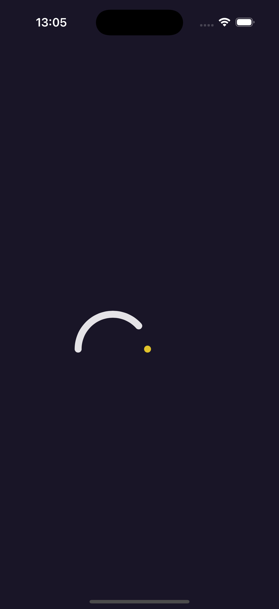

# Loading animation 

Show infinite loading with animation in SwiftUI.
## Inspiration 💡

The main idea of this source code is based on [Loading](https://dribbble.com/shots/14119730-loading), created by [bingbing](https://dribbble.com/bingbing) as part of the [Nice100Team](https://dribbble.com/Nice100).

## Screenshots 🌃



## The tech stack used in this project 🛠

- SwiftUI
- Animation
- Shape (Path)

## Usage

1. Clone the repository:

  ``` bash
    git clone https://github.com/helloItsHEssam/Loading.git
  ```

###  Contributing 🤝

Contributions, issues, and feature requests are welcome! Feel free to fork the repository and submit a pull request with your changes.

## License

Please check [LICENSE](LICENSE) for details.